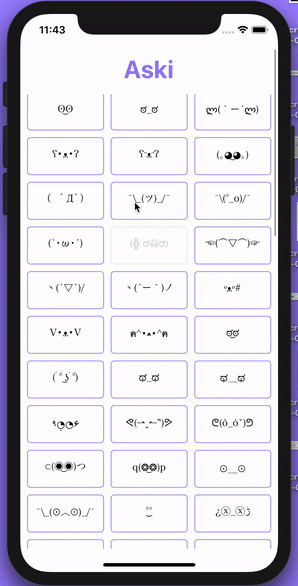

<h1 align="center">Aski ⊂(◉‿◉)つ</h1>

> Aski is a fun simple way to get super great ascii emojis

  

## Running Locally
Aski is built with expo & react native.
1. install [node](https://nodejs.org/en/) and [yarn](https://yarnpkg.com/en/)
2. clone the repo `git clone git@github.com:devinroche/aski.git; cd ./aski`
3. install deps with `yarn`
4. run `yarn start`

You'll then be in the [expo development environment](https://docs.expo.io/versions/latest/).
If you already have XCode installed with a simulator, you can just press `i` to start it.
